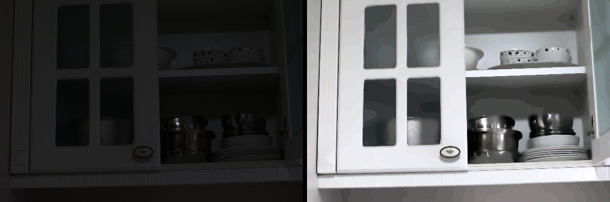
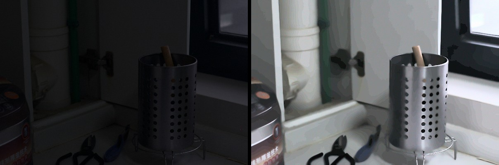
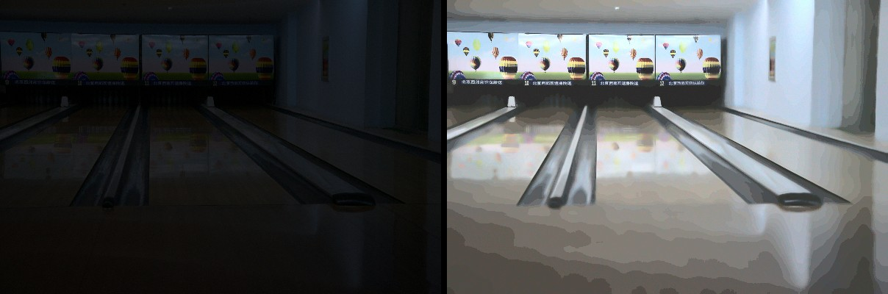

# Low-light Image Enhancement using Autoencoder and Histogram Matching

Project A042. A web app that takes an underexposed photo and returns an enhanced version: a convolutional
autoencoder brightens and denoises it, then histogram matching refines the tones. The result is shown next to
the original with a before/after slider, a luminance histogram, and PSNR / SSIM when a ground-truth image is given.

**Live demo: https://low-light-enhancment.onrender.com** (free hosting: the first visit after a quiet spell takes
about a minute to wake the server). Works on phones as well as desktop.



> **Status:** the trained weights are not included, so the app runs in **demo mode**: a classical
> denoise-and-lift stage stands in for the autoencoder, and histogram matching runs as normal. `train.py` trains
> the real model on the LOL dataset (see [Training](#training)).

## Quick start
Python 3.9 or newer.

```
pip install -r requirements-web.txt
python app.py
```

Open http://127.0.0.1:5000. On macOS, port 5000 is usually taken by AirPlay Receiver; use another port:
`PORT=5050 python app.py`. Pick one of the examples under the image box to try it straight away.

`requirements-web.txt` is enough for demo mode. Install `requirements.txt` (adds PyTorch) to train or to serve
trained weights.

## Results
Demo mode at the default settings on the LOL test set (eval15, 15 genuine low-light captures, each with a
normal-exposure shot of the same scene). Scores compare against that normal-exposure shot.

| | PSNR (dB) | SSIM |
|---|---|---|
| Low-light input | 7.8 | 0.19 |
| Enhanced, average of all 15 | 15.9 | 0.60 |

Three of the better results, also available as one-click examples in the app:

| | |
|---|---|
|  | **Kitchen**<br>PSNR 5.1 → 18.2 dB<br>SSIM 0.20 → 0.71 |
|  | **Window**<br>PSNR 5.6 → 17.7 dB<br>SSIM 0.19 → 0.68 |
|  | **Bowling alley**<br>PSNR 6.8 → 19.1 dB<br>SSIM 0.19 → 0.67 |

**Limitations of demo mode.** On the darkest captures (average level below about 10/255) it loses most of the
colour, smooths heavy noise into flat patches, and shows banding on smooth surfaces, because only a few brightness
levels survive in an 8-bit image that dark. Recovering those is the job of the trained autoencoder.

## How it works
1. **Resize** so the longest side is at most 768 px.
2. **Stage 1, brighten and denoise.**
   - *Trained mode:* the autoencoder in `model.py`, a U-Net style network (encoder 32 → 64 → 128 → 256 channels
     with skip connections, sigmoid output). Input is padded to a multiple of 8.
   - *Demo mode:* works in LAB colour space. Non-local-means denoising scaled to the measured noise level, a
     lightness lift to the target brightness, automatic black and white points, and a colour boost that keeps up
     with the lift.
   - Either way, any colour cast the stage adds is removed afterwards.
3. **Stage 2, histogram matching** (`enhance.py`), against one of:
   - *A reference image you upload:* each RGB channel is matched, so the result takes on its colours and tones.
   - *The default reference:* the average distribution of the LOL normal-exposure images
     (`weights/reference_cdf.npy`, written by `train.py`), or a smooth built-in curve without it. It is shifted to
     the target brightness and matched on lightness only, so the image keeps its own colours. The contrast gain is
     capped so leftover noise is not stretched into blotches, the black point is kept, and it never darkens.
4. **Measurements:** mean brightness and contrast for each stage, plus PSNR and SSIM against the ground truth.

Stage 1 takes most of the time, so the last few results are cached: changing the matching strength, switching
matching on or off, or adding a ground truth reuses it. While a request is running, further setting changes wait
and only the latest is sent, so a slow server does not pile up work.

### On phones
The layout becomes one column with the result right after the image. Tap the image box to pick a photo or take
one; drag sideways on the result to move the divider (vertical swipes scroll the page); **Share / Save** opens the
share sheet, where "Save Image" puts the result in Photos. Large photos are scaled down to 1536 px in the browser
before upload (the server works at 768 px), so a 3–5 MB phone photo is sent as a few hundred KB. iPhone HEIC
photos are supported, and photos taken in portrait are turned upright from their EXIF orientation.

### Controls
- **Brightness** (0.3–0.8, default 0.6): target mean lightness. With trained weights it acts through the default
  reference, so it is greyed out when matching is off or a reference image is uploaded.
- **Histogram matching** on or off, and **matching strength** (0–1) to blend the matched result with stage 1.
- **Reference image** (optional): match its colours and tones instead of the default reference.
- **Ground truth** (optional): the well-lit version of the same scene, to compute PSNR and SSIM.

## Training
Download the [LOL dataset](https://daooshee.github.io/BMVC2018website/) (485 training and 15 test pairs), then:

```
pip install -r requirements.txt
python train.py --data path/to/LOL --epochs 100
```

Expected layout: `LOL/our485/{low,high}` and `LOL/eval15/{low,high}`. Training uses random 256 px crops at the
images' own resolution (the scale the app runs at), L1 + SSIM loss, Adam with a cosine learning-rate schedule, and
keeps the checkpoint with the best validation PSNR. It writes `weights/autoencoder.pt` and
`weights/reference_cdf.npy`; the app switches to trained mode on its next start.

`train.py` uses an NVIDIA GPU (CUDA) if there is one and the CPU otherwise. Measured on an Apple M5, the CPU needs
about 7 minutes per epoch (around 11 hours for 100 epochs).

## API
`POST /api/enhance` (multipart form)

| Field | | |
|---|---|---|
| `image` | required | the low-light image |
| `reference` | optional | image whose colours and tones to match |
| `truth` | optional | well-lit version, for PSNR / SSIM |
| `matching` | optional | `1` (default) or `0` |
| `strength` | optional | 0–1, default 1 |
| `brightness` | optional | 0.3–0.8, default 0.6 |

Returns JSON with `mode` (`demo` or `autoencoder`), `images` (`original`, `autoencoder`, `final` as PNG data
URLs), `hist`, `stats` and, with a ground truth, `metrics`. `GET /api/status` returns the mode.

## Deployment
The `Dockerfile` serves demo mode with gunicorn. It installs `requirements-web.txt` (no PyTorch), so it fits a
small free instance (about 120 MB of memory in use). It listens on `$PORT` (default 8000):

```
docker build -t low-light .
docker run -p 8000:8000 low-light
```

**Render** (how the live demo is hosted): New → Web Service → Public Git Repository → this repo's URL, language
Docker, branch `main`, instance type Free. A service deployed from a public URL does not redeploy on push; use
Manual Deploy → Deploy latest commit. On the free tier a request takes several seconds rather than about one.

Running `python app.py` directly is for local use. The Flask debugger is off unless `FLASK_DEBUG=1`, and `HOST` and
`PORT` set the address.

## Development
```
pip install -r requirements.txt pytest
pytest
```

The tests cover the pipeline (demo and trained mode, using a stand-in network) and the API.
`python make_examples.py --data path/to/LOL` rebuilds the example images and prints scores for all 15 test pairs.

## Project structure
```
app.py                Flask server and API
enhance.py            pipeline: stage 1, colour balance, histogram matching, metrics
model.py              autoencoder
train.py              training on LOL
make_examples.py      builds static/examples/ from the LOL test set
templates/index.html  frontend
static/examples/      example low-light captures, ground truths, before/after images
tests/                pytest suite (tests/data: a small HEIC file)
Dockerfile            container for hosting (demo mode)
```

## Credits
Example images are from the LOL dataset: Chen Wei, Wenjing Wang, Wenhan Yang and Jiaying Liu, "Deep Retinex
Decomposition for Low-Light Enhancement", BMVC 2018. Used here for research and education.
