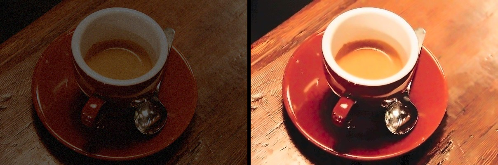
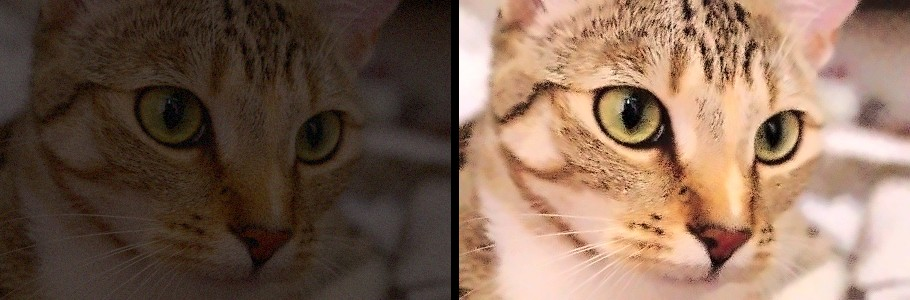
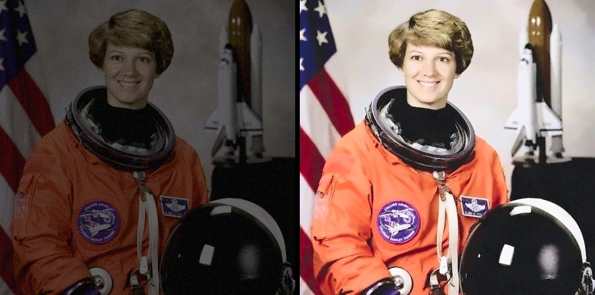

# Low-light Image Enhancement using Autoencoder and Histogram Matching

Web app for project A042. Upload a dark image and get an enhanced one, with a before/after slider,
histogram comparison, and PSNR/SSIM when a ground truth image is provided.

## Examples
Low-light input (left) and enhanced result (right), demo mode at the default settings. PSNR / SSIM against the
original well-lit photo:

| | |
|---|---|
|  | **Coffee**<br>PSNR 10.4 → 17.6 dB<br>SSIM 0.40 → 0.70 |
|  | **Cat**<br>PSNR 10.4 → 13.4 dB<br>SSIM 0.41 → 0.74 |
|  | **Astronaut**<br>PSNR 9.3 → 19.3 dB<br>SSIM 0.39 → 0.71 |

These are scikit-image sample photos (public domain / CC0), darkened to simulate an underexposed, noisy capture.
In the app, click one under "or try an example": it loads the dark photo with the original as ground truth, so the
PSNR / SSIM panel fills in. Rebuild them with `python make_examples.py`.

## Pipeline
1. Resize (max side 768 px) and run the convolutional autoencoder (`model.py`) for brightening and denoising.
2. Histogram matching (`enhance.py`) per RGB channel against a reference distribution:
   a reference image you upload, or the average of the LOL high-light images (`weights/reference_cdf.npy`).
3. Metrics and histograms returned to the browser.

## Setup
```
pip install -r requirements.txt
```

## Train (needs the LOL dataset)
```
python train.py --data path/to/LOL --epochs 100
```
Training uses random 256 px crops at native resolution (the same scale the app runs at) and validates on full images.
This writes `weights/autoencoder.pt` and `weights/reference_cdf.npy`. A GPU is recommended.

## Run
```
python app.py
```
Open http://127.0.0.1:5000. Set `HOST`, `PORT` and `FLASK_DEBUG=1` (local development only) through environment variables. Without trained weights the app runs in demo mode so you can still try the interface
and histogram matching. The demo first stage works in LAB: noise-adaptive denoising (strength set from the measured
noise level), a lightness lift to the chosen brightness with automatic black and white points, a colour boost that
keeps up with the lift, and colour-cast correction.

Controls: histogram matching on/off, matching strength, and target brightness (0.3-0.8, default 0.6).
With the default reference, matching is applied to lightness only, with a capped contrast gain, and never darkens.
The mean brightness it aims for is restored with a gain anchored at the darkest level, so blacks stay black.
The default reference (learned or built in) is shifted to the target brightness, so the brightness control also works with
trained weights. With trained weights it has no effect when matching is off or a reference image is uploaded, and the
slider is greyed out in those cases.

## Tests
```
pip install pytest
pytest
```

## Files
- `app.py` Flask server and API
- `enhance.py` pipeline, histogram matching, metrics
- `model.py` autoencoder
- `train.py` training on LOL
- `templates/index.html` frontend
- `make_examples.py` builds the example images in `static/examples/`
